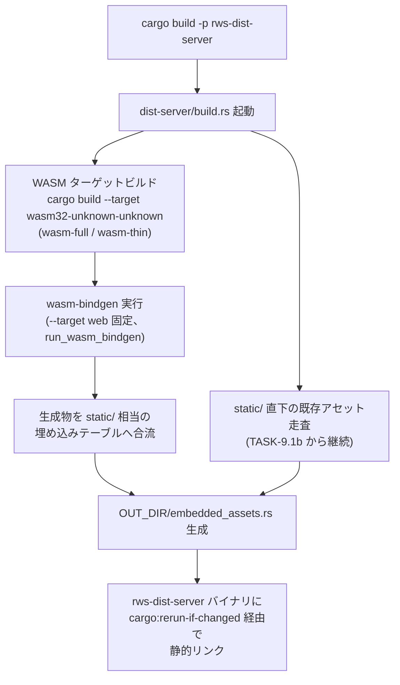

# WASM ビルドの cargo build 統合（TASK-10.2d）

> **本書のステータス**: 親タスク TASK-10.2（#108）の 4h 分割サブタスクは
> すべて実装が完了しています。TASK-10.2b（WASM ビルド呼び出し、#110、
> PR #217）・TASK-10.2a（build.rs 方式の設計確定、#109）・TASK-10.2c
> （キャッシュ・再ビルド制御、#111）のいずれも `dist-server/build.rs` に
> 実装済みです。本書は as-built（実装済みコードの引用）として記述します。
> 検証・条件 3 解消判定は `docs/reports/wasm-build-integration-report.md`
> （TASK-10.2e・#113）を参照してください。

## 1. 目的とトレーサビリティ

- **関連要件**: REQ-10「開発時 DX（アセット変更の即時反映・WASM ビルドチェーンの
  cargo 統合）」（`docs/spec/04-requirements.md` 132〜142 行目）。
- **Conditional Go 条件 3**: 「WASM ビルドチェーンの cargo 統合」
  （`docs/spec/04-requirements.md` 26 行目）。本書はこの条件解消に向けた設計・
  利用手順・セキュリティ考慮の文書化を担います。条件そのものの解消可否判定は
  後続の TASK-10.2e（#113）のスコープです。
- **親タスク**: TASK-10.2【Conditional Go 条件 3】（#108、`docs/spec/05-tasks.md`
  251〜256 行目）。成果物は `dist-server/build.rs`（既存の静的アセット埋め込み
  実装への機能追加、または統合ビルドツール導入）と本書 `docs/design/wasm-build-integration.md`
  の 2 点。本書は後者を満たします。
- **サブタスク分割**（本書が対応するのは 10.2d のみ）:

| サブタスク | Issue | 内容 | 本書との関係 |
|-----------|-------|------|-------------|
| TASK-10.2a | #109（完了） | build.rs 方式の設計確定 | §3「統合方式の設計判断」の出所 |
| TASK-10.2b | #110（完了・PR #217） | WASM ビルド呼び出しの実装 | §4「ビルドフロー」の出所 |
| TASK-10.2c | #111（完了） | キャッシュ・再ビルド制御の実装 | §5「キャッシュ・再ビルド制御」の出所 |
| TASK-10.2d | #112（本書・完了） | 統合ビルド機構のドキュメント化 | 本書そのもの |
| TASK-10.2e | #113 | 条件 3 解消の検証レポート | 本書の記述を含む TASK-10.2 全体の受け入れ判定 |

- **関連 PoC**: PoC-3・PoC-4・PoC-5（いずれも `cargo build -p <server>` が
  `wasm32-unknown-unknown` ターゲットビルドを自動的に含まず、
  `wasm-bindgen-cli` を別コマンド系統で実行する必要があるという DX 上の詰まりを
  繰り返し確認）。

## 2. 背景: 2 系統ビルド問題

PoC-3・PoC-4・PoC-5 では、WASM を用いるクライアント成果物（`wasm-full`・
`wasm-thin`）を得るために、開発者が次の 2 系統のコマンドを手動で使い分ける
必要がありました。

```sh
# 系統 1: ネイティブサーバーのビルド（従来の cargo build のみで完結）
cargo build -p rws-dist-server

# 系統 2: WASM 成果物のビルド（別コマンド系統。従来は cargo build に含まれない）
cargo build --target wasm32-unknown-unknown --release -p rws-wasm-full
wasm-bindgen --target web --out-dir <出力先> \
  target/wasm32-unknown-unknown/release/rws_wasm_full.wasm
```

この 2 系統化は次の問題を生みます。

- **DX の低下**: 開発者は 2 つのビルドコマンド系統と、それぞれの成果物の
  合流先を覚える必要があります。
- **CI 再現性リスク**: `cargo build` 単体を CI ステップに書いただけでは
  WASM 成果物が生成されず、ビルドスクリプトや CI ワークフロー側で系統 2 を
  別途明示しない限り、成果物欠落に気づきにくい構成になります。
- **単一バイナリ配布との不整合**: `rws-dist-server`（TASK-9.1）は
  コンパイル時埋め込みによる単一実行ファイル配布を前提としており
  （`docs/design/dist-server-design.md` 参照）、WASM 成果物が `cargo build` の
  ビルドグラフに含まれないと、埋め込み対象のアセットが手動生成物に
  依存する不整合な配布フローになります。

REQ-10 はこの詰まりを解消するため、単一の `cargo build` でネイティブ・WASM
双方の成果物を生成する統合ビルド機構を Must 要件として定めています。

## 3. 統合方式の設計判断（確定・TASK-10.2a）

`docs/spec/05-tasks.md` TASK-10.2 が「人間が方針決定し実装は Claude Code が
担当する」設計判断事項と位置づけた統合方式（`build.rs` 自前実装 vs
`wasm-pack`/`trunk` 相当の統合ツール採用）は、**`build.rs` 自前実装を採用**
として確定しました（TASK-10.2a・#109）。既に main へマージ済みで CI 実証
済みの実装（`dist-server/build.rs` の `run_wasm_build`/`run_wasm_bindgen`）
と一致する方式の追認であり、新たな方式変更のリスクを取らない判断です。

確定の根拠は次のとおりです。

- **REQ-3（依存グラフ上限 60 件以内・深さ 6 以内）**: `dist-server/Cargo.toml`
  の実測コメントによれば、標準サーバー構成（`rws-dist-server`）は 21 件/
  深さ 5 で PASS しています（TASK-10.2c 実装後も build-dependencies を追加
  していないため不変）。`build.rs` 自前実装は build-dependencies を一切
  追加しないため、この実測値をそのまま維持できます。
- **サプライチェーン**: `wasm-pack`・`trunk` は外部バイナリの導入経路を
  追加で必要とし脅威面が拡大します。`wasm-bindgen-cli` のみをバージョン
  固定 + バージョン整合検証で導入する現行運用が最小構成です（§8 参照）。
- **`build.rs` 自前実装との整合**: `dist-server/build.rs`（TASK-9.1b・PR #212）
  は、静的アセット埋め込みにおいて `rust-embed` が REQ-3 の深さ上限を構造的に
  超過する（実測: 66 件/深さ 8）ため、外部 `build-dependencies` を一切
  追加しない自前実装を採用した経緯があります（`dist-server/Cargo.toml` の
  実測コメント、`docs/design/dist-server-design.md` §4 参照）。WASM ビルド統合の
  キャッシュ制御（TASK-10.2c・#111 のハッシュ計算含む）も同一方針で
  std のみによる自前実装（FNV-1a ハッシュの自前実装、外部ハッシュ用クレート
  不使用）としました。
- **release 固定（debug wasm 非対応）**: TASK-10.2c（#111）の論点だった
  「開発用に debug プロファイルの WASM ビルドも許容するか」は、**release
  固定を維持**で確定しました。埋め込み対象は配布用成果物であり REQ-11
  バンドルサイズ基準と整合するためです。開発時の高速なロジック確認は
  `--target nodejs` のオプトイン経路（§6.4）が別途担います。
- **実証済み**: CI の `test` ジョブが単一 `cargo build` によるネイティブ +
  WASM 統合ビルドを既に再現しています。

## 4. ビルドフロー

以下は REQ-10 受け入れ基準「`cargo build`（単一コマンド）でネイティブサーバー
バイナリと WASM クライアント成果物の双方が生成される」を満たすビルドフロー
です。TASK-10.2b（#110・PR #217、マージ済み）により
`dist-server/build.rs` の [`run_wasm_build`]・[`run_wasm_bindgen`] 関数として
実装済みです。

> **`--target web` は本番・埋め込みの唯一の経路**: `run_wasm_bindgen`
> （`dist-server/build.rs`）は `wasm-bindgen --target web --no-typescript`
> を固定で実行し、生成された ES module 形式の JS グルーコードのみを
> 埋め込みテーブル（`OUT_DIR/embedded_assets.rs`）へ合流させます。
> `--target nodejs`（§6.4 参照）はこのビルドグラフの**外側**にある開発者
> オプトインの手動経路であり、`cargo build -p rws-dist-server` からは
> 一切呼び出されません。本番配布物に `--target nodejs` の生成物（CommonJS
> グルーコード）が混入することはありません（§8 の不変条件）。



- **既存経路（TASK-9.1b）との関係**: `dist-server/build.rs` は
  `static/` 配下の `(URL パス, ファイル内容)` テーブルを `include_bytes!` で
  生成する自前実装（TASK-9.1b 由来）に加え、TASK-10.2 で「WASM ターゲット
  ビルド + `wasm-bindgen` 実行」のステップを前段として追加し、生成された
  `.wasm`/`.js` 成果物が同じ埋め込みテーブル生成の入力（`/static/wasm/`
  配下の URL パス）へ合流する構成になっています。
- **TASK-10.1（開発/本番モード切り替え）との関係**: TASK-10.1a/b
  （#215/#216、マージ済み）が導入した `cfg(debug_assertions)` /
  `force-embed` フィーチャーによる開発時ファイルシステム読み込みと
  本番埋め込みの切り替えは `static/` 配下のアセットが対象です。WASM 成果物
  は TASK-10.2 のスコープでは常にコンパイル時埋め込み（`OUT_DIR` 経由）を
  経由し、この切り替え軸の対象外である点が実装確定時の相違点です
  （§9 の受け入れ基準対応表を参照）。

## 5. キャッシュ・再ビルド制御（実装済み・TASK-10.2c）

REQ-10 の受け入れ基準「本番差分ビルド反映が 5 秒以内であること」
（PoC-4 実績 0.571〜0.597 秒）は、WASM ビルドステップを `build.rs` に
追加した後も維持されています（実測は
`docs/reports/wasm-build-integration-report.md` §5 参照。`dist-server/benches/
rebuild_latency.rs` による自動計測）。

`dist-server/build.rs` の実装は次のとおりです（既存 `build.rs` の
`cargo:rerun-if-changed` パターンの延長）。

- **ネストビルドは常に実行、`wasm-bindgen` のみキャッシュ制御**:
  `cargo build --target wasm32-unknown-unknown`（`run_wasm_build`）自体は
  cargo 標準の増分ビルドキャッシュ（`target/wasm-dist/`）が効くため常に
  実行します。本ステージが独自にキャッシュ判定を行うのは、その後段の
  `wasm-bindgen` 実行（`run_wasm_bindgen`）のみです。
- **fingerprint 方式**: ネストビルドが生成した `.wasm` の内容ハッシュ
  （std のみで完結する自前 FNV-1a 実装、`fnv1a_hash`）と、インストール済み
  `wasm-bindgen-cli` の実バージョンを束ねた文字列を `OUT_DIR/
  wasm-stage.fingerprint` に保存します（`compute_wasm_stage_fingerprint`）。
  次回以降のビルドで、この fingerprint が前回値と完全一致し、かつ
  `OUT_DIR/wasm-assets/` に前回の成果物（`<stem>.js`/`<stem>_bg.wasm`）が
  実際に残っている場合に限り `wasm-bindgen` の再実行をスキップします
  （`wasm_stage_cache_hit`）。
- **フェイルクローズ**: fingerprint の読み取り失敗・欠落・不一致・成果物
  欠落のいずれでも「再実行」側へ倒します。fingerprint ファイルの書き込みは
  `wasm-bindgen` が成功し成果物の存在を確認した**後**にのみ行います
  （`write_wasm_stage_fingerprint`）。失敗・中断時に不完全な成果物と
  一致する fingerprint が残る事故を避けるためです。
- **`cargo:rerun-if-changed` による再実行トリガー**: `wasm-full/src`・
  `wasm-full/Cargo.toml`・`interactive/src`・`core/src`・`Cargo.lock` の
  変更で `build.rs` 自体（cargo による再実行）が発火します。ここから先の
  「`wasm-bindgen` を実際に再実行するか」の判断は上記 fingerprint 比較が
  担うため、無関係なファイル変更（例: `static/` 配下のみの変更）では
  ネストビルドが同一バイナリを再生成し、fingerprint が一致して
  `wasm-bindgen` はスキップされます。
- **`cargo build` 自体の増分ビルドとの整合**: `cargo build --target
  wasm32-unknown-unknown` 自体は cargo 標準の増分ビルドキャッシュ
  （`target/` 配下）が効くため、`build.rs` 側は「WASM ソースが変化した
  場合のみ `wasm-bindgen` を再実行する」判断ロジックに専念すればよく、
  WASM コンパイル自体のキャッシュ機構を独自実装する必要はありません。
- **タイムスタンプ比較 or 内容ハッシュ比較の選択**: 既存 `build.rs` は
  ファイル内容そのものを `include_bytes!` するため差分検知に
  `cargo:rerun-if-changed` のみで足りますが、WASM 生成物（`.wasm`/`.js`）は
  中間生成物であるため、上記の内容ハッシュ比較（タイムスタンプ比較ではなく
  ハッシュ比較を選択）で再利用可否を判定します。タイムスタンプ比較は
  ファイルシステムの時刻粒度・クロックスキューに依存し偽陽性/偽陰性を
  生みやすいため採用しませんでした。

## 6. 利用者向け手順

### 6.1 前提ツールチェーン

```sh
# wasm32 ターゲットの追加（初回のみ）
rustup target add wasm32-unknown-unknown

# wasm-bindgen-cli はバージョン固定で導入する（§8 参照）
# バージョンは wasm-full / wasm-thin の Cargo.toml が指定する
# wasm-bindgen クレートのバージョンと一致させること
# （wasm-bindgen-cli と wasm-bindgen クレートのバージョン不一致は
#  ビルド時エラーの典型的な原因）
cargo install wasm-bindgen-cli --version <固定バージョン> --locked
```

### 6.2 ビルド・確認手順

```sh
# ネイティブ・WASM 双方を単一コマンドで生成する（設計契約）
cargo build -p rws-dist-server --release

# 生成されたバイナリを起動して疎通確認
./target/release/dist-server
```

### 6.3 トラブルシューティング（想定される事象）

| 事象 | 想定原因 | 対処 |
|------|---------|------|
| `wasm-bindgen: version mismatch` 相当のエラー | `wasm-bindgen-cli` と WASM クレートが依存する `wasm-bindgen` クレートのバージョン不一致 | `wasm-bindgen-cli` を対象バージョンで入れ直す（6.1 節） |
| WASM 成果物の変更が `cargo build` に反映されない | `cargo:rerun-if-changed` の対象パス漏れ、または `wasm-full/src` 等の変更が意図せずキャッシュ HIT 扱いになっている | `build.rs` の `rerun-if-changed` 対象に該当パスが含まれているか確認。`cargo build -vv` の出力で `wasm-stage cache HIT`/`MISS` のいずれが出ているか確認する（§5） |
| release ビルドで WASM 成果物が古いまま埋め込まれる | 開発/本番モード切り替え（TASK-10.1）の `force-embed` 判定誤り | §4 の開発/本番切り替え条件を確認 |
| キャッシュが効かず毎回 `wasm-bindgen` が再実行される | `wasm-full`/`interactive`/`core` のソースが実際に変化している（ネストビルドの `.wasm` 内容ハッシュが変わるため正しい挙動）、または `OUT_DIR/wasm-assets/` の成果物が欠落・破損している | `cargo build -vv` で `wasm-stage cache MISS` の理由（ソース変更か成果物欠落か）を切り分ける。`cargo clean` 後の初回ビルドでは常に MISS になる（fingerprint 未保存のため）のが正常 |
| キャッシュが効きすぎて古い WASM がそのまま使われる（疑い） | fingerprint 比較・成果物存在確認のいずれかにバグがある可能性 | `wasm_stage_cache_hit`（`dist-server/build.rs`）のフェイルクローズ条件（fingerprint 完全一致 **かつ** `<stem>.js`/`<stem>_bg.wasm` の両方が存在）を確認。疑わしい場合は `OUT_DIR/wasm-stage.fingerprint` を手動削除して強制的に MISS へ倒す |

### 6.4 wasm-bindgen 出力ターゲットの使い分け（web / nodejs）

PoC-5（`docs/spec/03-poc/wasm-runtime-split/README.md` 178 行目）は、
`wasm-bindgen` が生成できる出力ターゲットのうち `--target web`（本番）と
`--target nodejs`（開発）を役割分担して使い分ける必要があることを確認して
います（#161・TASK-10.2 系列の一部としての DX 設計）。本節はこの使い分けを
文書化するもので、`dist-server/build.rs` のビルドグラフ（§4）には影響しま
せん。

| 観点 | `--target web`（本番） | `--target nodejs`（開発） |
|------|------------------------|---------------------------|
| 用途 | ブラウザ配布・`dist-server` への埋め込み | `web-sys` 非依存クレート（`rws-wasm-thin` 系）のロジック確認・タイミング近似計測（`rws-wasm-full`/`rws-wasm-client` へ拡張しない判断は §6.4.1 参照） |
| 実行経路 | `cargo build -p rws-dist-server`（`run_wasm_build`・`run_wasm_bindgen` による自動実行、§4） | 開発者が手動で実行するオプトイン経路（下記コマンド例）。`build.rs` のビルドグラフ外 |
| 出力先 | `OUT_DIR` 経由で埋め込みテーブル（`embedded_assets.rs`）へ合流 | `target/wasm-node/` 配下（`.gitignore` の `/target` により VCS 追跡外） |
| 検証上の位置付け | 正式なブラウザ実証は `wasm-pack test --headless --chrome`（`docs/guides/browser-testing.md`、CI の `browser-test`/`perf-harness` ジョブ） | ブラウザ実測の代替ではなく、`web-sys` を介さないロジックの高速な近似確認・補助（PoC-5 が明記する環境制約の踏襲） |
| ツール | `wasm-bindgen-cli`（§8 のバージョン固定 + チェックサム検証を適用） | 同一 CLI で両ターゲットを出力可能。追加導入は不要 |

**開発時のコマンド例**（`rws-wasm-thin` のロジックを Node.js で素早く確認する
場合。PoC-5 の実績コマンドを踏襲）:

```sh
# 1. wasm32 ターゲットへネイティブビルド（release でなくても可）
cargo build --target wasm32-unknown-unknown -p rws-wasm-thin

# 2. --target nodejs で CommonJS 形式のバインディングを生成
#    出力先は target/ 配下（VCS 追跡外・本番埋め込み対象外）に限定する
wasm-bindgen --target nodejs \
  --out-dir target/wasm-node/thin \
  target/wasm32-unknown-unknown/debug/rws_wasm_thin.wasm

# 3. Node.js から require() して同期的にロジックを呼び出す
node -e "const m = require('./target/wasm-node/thin'); console.log(m.some_exported_fn());"
```

**不変条件**（§8 のセキュリティ考慮と対になる開発ワークフロー上の制約）:

- `--target nodejs` の生成物を `static/` や埋め込み入力ディレクトリへコピー・
  配置しない（本番埋め込みへの混入防止）。
- `--target nodejs` はブラウザ環境の実証を代替しない。ブラウザ挙動の正式な
  検証は必ず `docs/guides/browser-testing.md` の手順（実ブラウザ・ヘッドレス Chrome）
  で行う。
- 上記のコマンド列は `cargo xtask wasm-node-smoke [--build-only]`
  （イシュー #297、`xtask/src/wasm_node_smoke.rs`）としてツール化済みです。
  wasm-bindgen-cli のバージョン整合検証・wasm32 ビルド・`--target nodejs`
  バインディング生成・node 実行での既定エスケープ（REQ-1）回帰検証までを
  1 コマンドで行い、`.github/workflows/ci.yml` の `wasm-node-smoke` ジョブが
  CI ゲートとして実行します（§10 参照）。

#### 6.4.1 `rws-wasm-full` / `rws-wasm-client` へ拡張しない判断（イシュー #317）

`wasm-node-smoke`（前節）の対象を `rws-wasm-thin` 単一のまま維持し、
`rws-wasm-full` / `rws-wasm-client` へのマルチパッケージ対応は行わない
と判断しました。根拠は以下の 4 点です。

1. **nodejs バインディングから到達できるロジックが存在しない**:
   両クレートの `#[wasm_bindgen]` エクスポートは `mount` / `hydrate`
   （`wasm-full/src/entry.rs:73,89`）、`hydrate` / `mount_csr`
   （`wasm-client/src/lib.rs:193,255`）のみで、いずれも `window()` /
   `document()` 等の実 DOM（`web-sys`）に依存します。nodejs 環境には
   DOM が存在しないため実行できません。node で検証する価値がある純粋
   ロジック（`render_component_html`、`dispatch_and_render_headless`、
   `render_list_page_html` / `render_detail_page_html` /
   `find_hydrate_target_kinds` / `find_list_nav_targets`
   （`wasm-client/src/lib.rs:78-141`）等）は `#[wasm_bindgen]` が
   付与されていない（ジェネリクス制約、または単に非公開エクスポート）
   ため、nodejs バインディング経由では到達不能です。
2. **既存の native テストと重複する**: 上記の純粋ロジックは
   `wasm-full/tests/runtime_headless.rs` / `dom_update.rs` /
   `xss_escape_wasm.rs`（XSS 回帰）、`wasm-client/tests/hydration_targets.rs`、
   および各関数の doctest により、native `cargo test` で毎 CI 検証済みです。
3. **既存のブラウザ CI ジョブと重複する**: wasm32 ビルド + wasm-bindgen
   境界 + 実行の実証は `browser-test`（`wasm-pack test --headless --chrome`、
   `.github/workflows/ci.yml:613,623,632`）・`xss-wasm-test`・
   `perf-harness` の各ジョブが実ブラウザ上で毎 CI 検証済みです。
4. **拡張のコストが便益を上回る**: 意味のある検証を成立させるには
   (a) CI 目的の `#[wasm_bindgen]` エクスポートを製品クレートへ追加する
   （本番 cdylib のエクスポート面・サイズを REQ トレースなしで拡大し、
   `bundle_size.rs` のサイズ管理・API 表面最小化方針と衝突する）、
   (b) jsdom 等の npm 依存で DOM をエミュレートする（サプライチェーン面の
   拡大、REQ-12・脅威面最小化方針、`.claude/rules/security.md` と抵触する）、
   のいずれかが必要です。それを避けて require() ロードのみに留める
   スモークは、検証内容が「wasm32 ビルドと bindgen が通ること」に縮退し、
   これは browser-test 系ジョブがより強い形（実ブラウザでの実行まで）で
   既に毎 CI 検証しており純粋な重複になります。

**再検討条件**: `rws-wasm-full` / `rws-wasm-client` に `web-sys` 非依存の
`#[wasm_bindgen]` エクスポートが仕様（REQ）起点で追加された場合は、
本判断を再評価します。

## 7. TASK-10.3（Docker マルチステージ内再ビルド）との境界

Docker マルチステージビルド内での WASM ターゲット再ビルド・CI 環境での
再現性担保は TASK-10.3（`docs/spec/05-tasks.md` 258〜263 行目、#114）の
スコープです。本書が扱う `cargo build -p rws-dist-server` 単一コマンドでの
統合が前提となり、TASK-10.3 はこの単一コマンドを Docker ビルドステージ内で
そのまま実行する構成を想定します（REQ-10 受け入れ基準「Docker マルチステージ
ビルド内で WASM ターゲットの再ビルドが行われること」）。

## 8. セキュリティ考慮事項（OWASP Top 10 観点）

本書は docs-only の変更ですが、「AI 時代のセキュリティリスク低減」を掲げる
本フレームワークにおいて、ビルド機構そのものの記述はセキュリティ成果物
です。以下を本書の不変条件として明記し、実装（#109〜#111）はこれに従う
ことを前提とします。

- **A08 ソフトウェア・データ整合性（サプライチェーン）**:
  - `build.rs` はビルド時任意コード実行の経路です（PoC-1・PoC-2 の脅威
    モデル、`docs/spec/04-requirements.md` 28 行目「制約事項」に明記済み）。
    WASM ビルドステップの追加により `build.rs` の責務が増えますが、外部
    `build-dependencies`（Cargo クレートとしての依存）はゼロを維持します。
    `wasm-bindgen-cli` は Cargo の `build-dependencies` としてではなく、
    開発者・CI 環境に個別導入する外部バイナリツールとして扱うため、
    `dist-server/Cargo.toml` の依存グラフ実測値（REQ-3 対象）には算入され
    ません。ただし外部バイナリの導入経路自体がサプライチェーン面の攻撃面
    であることに変わりはなく、次の緩和策を必須とします。
  - `wasm-bindgen-cli` の導入は**バージョン固定 + チェックサム検証を必須**
    とします。`.github/workflows/ci.yml` が `wasm-pack` の導入で確立した
    パターン（`WASM_PACK_VERSION`/`WASM_PACK_SHA256` を環境変数で固定し、
    ダウンロード後に `sha256sum -c -` で検証してから `install -m 755` で
    配置する手順）を規範とし、`wasm-bindgen-cli` にも同様の固定 + 検証を
    適用します。
  - REQ-3（依存グラフ上限 60 件/深さ 6）を弱めない構成であることを、
    §9 の受け入れ基準対応表に明記します。`dist-server/Cargo.toml` へ
    新規に Cargo 依存クレートを追加する場合は、`coding-rust.md` の規約に
    従い事前に `cargo metadata` で影響を確認し、**ユーザー承認を得ること**
    を必須とします（#109〜#111 の実装が新規クレート追加を伴う場合の前提
    条件）。
  - `build.rs` が保有するクレートの一覧は `xtask list-build-scripts`
    （`xtask/src/list_build_scripts.rs`、TASK-3.2 系）で機械的に列挙可能な
    状態を維持します（REQ-3「監査可能性」、`docs/spec/04-requirements.md`
    192 行目）。
- **A03 インジェクション / XSS（REQ-1）**: WASM ビルド統合はビルド時の
  成果物生成経路の変更であり、実行時の HTML 生成・テキスト補間の経路には
  関与しません。既定エスケープの保証（`rws_core` のノード木 API 経由の
  レンダリング）は、WASM 成果物がどのビルド経路で生成されたかに関わらず
  維持されることを不変条件とします。本書のコード例・手順例は
  `format!` による HTML 直接組み立てを含みません。
- **A01 アクセス制御 / パストラバーサル**: `dist-server/build.rs` の既存
  実装は「コンパイル時埋め込みにより実行時ファイルシステムアクセスが
  構造的に発生しない」性質を持ちます（`dist-server/build.rs` 冒頭コメント
  参照）。WASM 成果物合流後もこの性質を維持し、生成された `.wasm`/`.js`
  ファイルは既存の `static/` 埋め込みテーブルと同じ `include_bytes!`
  経由でコンパイル時埋め込みとします。`static/` 配下のシンボリックリンク
  運用注意（外部リンクを置かない運用、`dist-server/build.rs` の
  `collect_files` コメント参照）は WASM 成果物合流後も同様に適用します。
- **A05 セキュリティ設定ミス**: 開発モード（`cfg(debug_assertions)` かつ
  `force-embed` 非有効）ではファイルシステムからの直接読み込みが有効に
  なりますが、本番ビルド（release、または `force-embed` 有効時の debug）
  では常にコンパイル時埋め込みとなる条件を維持します（TASK-10.1a/b・
  #215/#216 が確立した既存の切り替え条件、`dist-server/Cargo.toml` の
  `force-embed` フィーチャーコメント参照）。WASM ビルド統合はこの切り替え
  条件を変更しません。
  - **`--target nodejs` 生成物の本番混入防止**（§6.4）: `wasm-bindgen` の
    出力ターゲットは ES module（`--target web`）と CommonJS（`--target
    nodejs`）でバインディング形式が異なるのみで、開発用に生成した
    `--target nodejs` の CommonJS グルーコードを `static/` や埋め込み入力
    ディレクトリへ配置し `dist-server/build.rs` の埋め込みテーブルへ
    混入させないことを不変条件とします。出力先は `target/` 配下（`.gitignore`
    の `/target` により VCS 追跡外）に限定し、`run_wasm_build`/
    `run_wasm_bindgen`（§4）のビルドグラフには一切含めません。
- **機微情報**: 本書・関連コミットに API キー・トークン・実在の内部 URL 等を
  含めません。本書中のコマンド例・バージョン番号はいずれもプレースホルダ
  または一般公開されているツールの固定バージョン例であり、シークレットを
  含みません。

## 9. 受け入れ基準対応表

REQ-10（`docs/spec/04-requirements.md` 132〜142 行目）の受け入れ基準との
対応は次のとおりです。

| REQ-10 受け入れ基準 | 対応状況 | 担当 |
|---------------------|---------|------|
| 開発時のアセット変更（CSS 等）が、リビルド・プロセス再起動なしで反映されること | TASK-10.1（#215/#216）でマージ済み。本書のスコープ外（§7 参照） | TASK-10.1（完了） |
| 本番ビルドのアセット変更反映（差分ビルド）が 5 秒以内であること | §5「キャッシュ・再ビルド制御」に実装済みの fingerprint 方式を記述。実測は `dist-server/benches/rebuild_latency.rs`（TASK-10.4a、別イシューで実装済み）が計測し、`docs/reports/wasm-build-integration-report.md` §5 に転記 | TASK-10.2c（完了） / TASK-10.4a（別イシュー・完了） |
| `cargo build`（単一コマンド）で、ネイティブサーバーバイナリと WASM クライアント成果物の双方が生成されること | §4「ビルドフロー」が実装済みコード（`run_wasm_build`/`run_wasm_bindgen`）として記述。統合方式の設計判断（`build.rs` 自前実装採用）も §3 で確定済み | TASK-10.2a（完了） / TASK-10.2b（完了、本書 §4） |
| Docker マルチステージビルド内で WASM ターゲットの再ビルドが行われ、CI 環境での再現性が担保されること | 本書スコープ外。TASK-10.3（#114）で対応（§7 参照） | TASK-10.3 |

イシュー #161（wasm-bindgen 出力ターゲットの使い分け DX 設計）の受け入れ
条件との対応:

| #161 受け入れ条件 | 対応状況 |
|-------------------|---------|
| `--target web` / `--target nodejs` の使い分け設計が文書化されていること | §6.4 で使い分け表・利用手順・不変条件として記述済み |
| ビルドフローへの反映 | §4 に「`--target web` は本番・埋め込みの唯一の経路」「`--target nodejs` はビルドグラフ外の開発用オプトイン経路」を明記済み（`dist-server/build.rs` の変更は不要。build.rs 側の実装は発生しない設計） |

親イシュー #108 の受け入れ条件との対応:

| #108 受け入れ条件 | 対応状況 |
|-------------------|---------|
| 成果物が作成され、関連テストが通過する | `dist-server/build.rs`・本書 `docs/design/wasm-build-integration.md` がいずれも作成済み。`cargo test --workspace --locked`・`cargo clippy --workspace -- -D warnings`・`cargo fmt --check` を実装確認時に通過 |
| `docs/spec/05-tasks.md` の TASK-10.2 受け入れ基準を満たす | 上表参照。#109〜#112 すべて完了 |
| 既定エスケープ・`forbid(unsafe_code)`・依存グラフ上限（60 件/深さ 6）を弱めない | §8 参照。`rws-dist-server` の依存グラフは実装完了後も 21 件/深さ 5 で不変（build-dependencies 追加なし） |

## 10. スコープ外事項の列挙

以下は本タスク（TASK-10.2d・docs-only）の対象外として記録します。Issue 化は
ユーザー承認事項のため、本書では提案に留めます（`out-of-scope-tracking.md`
準拠）。

- **Docker マルチステージビルド内での WASM 再ビルド実装**: TASK-10.3（#114）
  のスコープ。本書 §7 で境界のみ明記。
- ~~**`cargo xtask` による nodejs ビルドサブコマンド実装**~~: イシュー #297
  で実装済み（`cargo xtask wasm-node-smoke`、§6.4 参照）。
- ~~**CI への nodejs ターゲットスモークテスト追加**~~: イシュー #297 で
  `.github/workflows/ci.yml` の `wasm-node-smoke` ジョブとして実装済み
  （§6.4 参照）。正式なブラウザ実証（`browser-test`/`xss-wasm-test` ジョブ）
  の代替ではなく、開発者手元での高速確認経路の CI 回帰検証という位置づけは
  変わりません。
- **条件 3（WASM ビルドチェーンの cargo 統合）解消の最終判定**:
  TASK-10.2e（#113）のスコープ。本書は判定に用いる文書的裏付けの提供に
  留まり、判定そのものは `docs/reports/wasm-build-integration-report.md` が行います。
- **CI ワークフローの WASM ジョブ統合**（`.github/workflows/ci.yml` の
  個別 WASM ジョブと `cargo build` のビルドグラフ統合）: TASK-10.2（本書の
  実装スコープ）では対応せず、`docs/reports/wasm-build-integration-report.md` §7
  に切り出し済み。
- ~~**`wasm-node-smoke` の `rws-wasm-full` / `rws-wasm-client` への拡張**~~:
  イシュー #317 で非拡張と判断済み（§6.4.1 参照）。

## 11. リスク・注意事項

- 本書は TASK-10.2a〜c（#109〜#111）の実装完了後に as-built 記述へ更新
  しました。§3〜§5 は実装済みコード（`dist-server/build.rs`）の引用です。
  今後 `dist-server/build.rs` に手を加える際は、本書との乖離が生じないよう
  同時に本書を追随更新してください（`docs/guides/embedding-guide.md` が確立した
  方式の踏襲）。
- `dist-server/build.rs` は静的アセット埋め込み（TASK-9.1b・PR #212）と
  WASM ビルドステージ（TASK-10.2）の両方を単一ファイルで担当する構成に
  確定しました（責務分離した別ステップへの分割は行わない設計判断、§3）。
