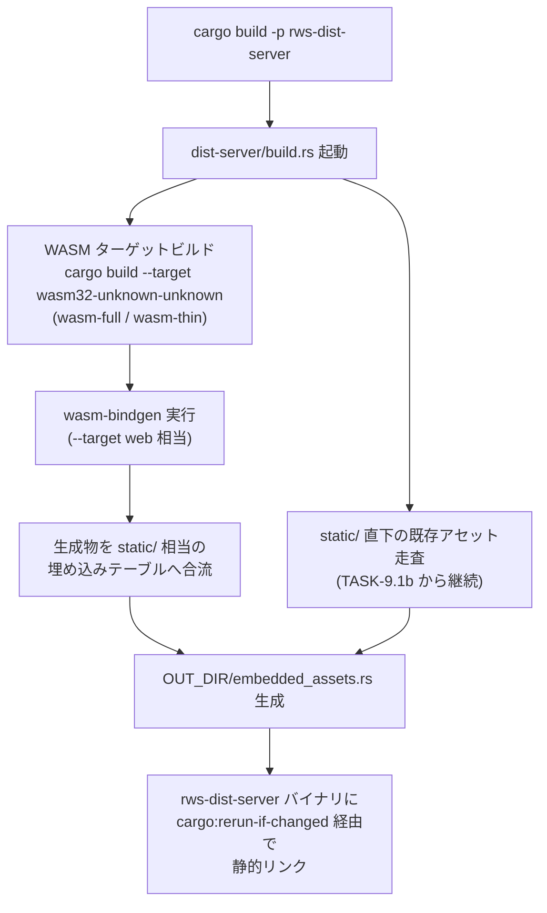

# WASM ビルドの cargo build 統合（TASK-10.2d）

> **本書のステータスと前提**: 本書の執筆時点で、親タスク TASK-10.2（#108）の
> 4h 分割サブタスクである TASK-10.2a（build.rs 方式の設計検討、#109）・
> TASK-10.2b（WASM ビルド呼び出しの実装、#110）・TASK-10.2c（キャッシュ・
> 再ビルド制御の実装、#111）はいずれも **OPEN（未マージ）** です。したがって
> 本書に登場する統合方式・ビルドフロー・キャッシュ制御の記述は、実装済み
> コードの引用ではなく、**REQ-10・`docs/spec/05-tasks.md` TASK-10.2 の要件と、
> 既存の `dist-server/build.rs`（TASK-9.1b・PR #212、静的アセット埋め込み用の
> 現行実装）の設計判断を土台にした設計契約**として提示しています
> （`docs/embedding-guide.md` が確立した「並行タスク前提での docs 執筆」方式を
> 踏襲）。#109〜#111 がマージされ本書の記述と実物に乖離が生じた場合は、
> それぞれの実装・設計確定書を正として本書を追随更新してください。

## 1. 目的とトレーサビリティ

- **関連要件**: REQ-10「開発時 DX（アセット変更の即時反映・WASM ビルドチェーンの
  cargo 統合）」（`docs/spec/04-requirements.md` 132〜142 行目）。
- **Conditional Go 条件 3**: 「WASM ビルドチェーンの cargo 統合」
  （`docs/spec/04-requirements.md` 26 行目）。本書はこの条件解消に向けた設計・
  利用手順・セキュリティ考慮の文書化を担います。条件そのものの解消可否判定は
  後続の TASK-10.2e（#113）のスコープです。
- **親タスク**: TASK-10.2【Conditional Go 条件 3】（#108、`docs/spec/05-tasks.md`
  251〜256 行目）。成果物は `dist-server/build.rs`（既存の静的アセット埋め込み
  実装への機能追加、または統合ビルドツール導入）と本書 `docs/wasm-build-integration.md`
  の 2 点。本書は後者を満たします。
- **サブタスク分割**（本書が対応するのは 10.2d のみ）:

| サブタスク | Issue | 内容 | 本書との関係 |
|-----------|-------|------|-------------|
| TASK-10.2a | #109 | build.rs 方式の設計検討 | §4「統合方式の設計判断」が引用する設計決定の出所 |
| TASK-10.2b | #110 | WASM ビルド呼び出しの実装 | §5「ビルドフロー」が記述する実装の出所 |
| TASK-10.2c | #111 | キャッシュ・再ビルド制御の実装 | §6「キャッシュ・再ビルド制御」が記述する実装の出所 |
| TASK-10.2d | #112（本書） | 統合ビルド機構のドキュメント化 | 本書そのもの |
| TASK-10.2e | #113 | 条件 3 解消の検証レポート | 本書の記述を含む TASK-10.2 全体の受け入れ判定 |

- **関連 PoC**: PoC-3・PoC-4・PoC-5（いずれも `cargo build -p <server>` が
  `wasm32-unknown-unknown` ターゲットビルドを自動的に含まず、
  `wasm-bindgen-cli` を別コマンド系統で実行する必要があるという DX 上の詰まりを
  繰り返し確認）。

## 2. 背景: 2 系統ビルド問題

PoC-3・PoC-4・PoC-5 では、WASM を用いるクライアント成果物（`wasm-full`・
`wasm-thin`）を得るために、開発者が次の 2 系統のコマンドを手動で使い分ける
必要がありました。

```sh
# 系統 1: ネイティブサーバーのビルド（従来の cargo build のみで完結）
cargo build -p rws-dist-server

# 系統 2: WASM 成果物のビルド（別コマンド系統。従来は cargo build に含まれない）
cargo build --target wasm32-unknown-unknown --release -p rws-wasm-full
wasm-bindgen --target web --out-dir <出力先> \
  target/wasm32-unknown-unknown/release/rws_wasm_full.wasm
```

この 2 系統化は次の問題を生みます。

- **DX の低下**: 開発者は 2 つのビルドコマンド系統と、それぞれの成果物の
  合流先を覚える必要があります。
- **CI 再現性リスク**: `cargo build` 単体を CI ステップに書いただけでは
  WASM 成果物が生成されず、ビルドスクリプトや CI ワークフロー側で系統 2 を
  別途明示しない限り、成果物欠落に気づきにくい構成になります。
- **単一バイナリ配布との不整合**: `rws-dist-server`（TASK-9.1）は
  コンパイル時埋め込みによる単一実行ファイル配布を前提としており
  （`docs/dist-server-design.md` 参照）、WASM 成果物が `cargo build` の
  ビルドグラフに含まれないと、埋め込み対象のアセットが手動生成物に
  依存する不整合な配布フローになります。

REQ-10 はこの詰まりを解消するため、単一の `cargo build` でネイティブ・WASM
双方の成果物を生成する統合ビルド機構を Must 要件として定めています。

## 3. 統合方式の設計判断

`docs/spec/05-tasks.md` TASK-10.2 は統合方式（`build.rs` 自前実装 vs
`wasm-pack`/`trunk` 相当の統合ツール採用）を「人間が方針決定し実装は Claude
Code が担当する」設計判断事項（担当: 共同）と位置づけています。この方針
決定そのものは TASK-10.2a（#109）のスコープです。

現時点（本書執筆時点、#109 未マージ）で参照可能な制約は次のとおりです。

- **REQ-3（依存グラフ上限 60 件以内・深さ 6 以内）**: `dist-server/Cargo.toml`
  の実測コメントによれば、標準サーバー構成（`rws-dist-server`）は 21 件/
  深さ 5 で PASS しています。`wasm-pack`・`trunk` は cargo サブコマンドとして
  ワークスペースの依存グラフそのものには加算されませんが、CI 環境への
  導入手段（`cargo install` 経由か、バイナリ配布のバージョン固定導入か）に
  よってサプライチェーン面の脅威面が変わるため、§8 のセキュリティ考慮と
  合わせて #109 で判断される想定です。
- **`build.rs` 自前実装との整合**: `dist-server/build.rs`（TASK-9.1b・PR #212）
  は、静的アセット埋め込みにおいて `rust-embed` が REQ-3 の深さ上限を構造的に
  超過する（実測: 66 件/深さ 8）ため、外部 `build-dependencies` を一切
  追加しない自前実装を採用した経緯があります（`dist-server/Cargo.toml` の
  実測コメント、`docs/dist-server-design.md` §4 参照）。WASM ビルド統合を
  同一の `build.rs` に追加する場合、この「`build-dependencies` ゼロ維持」
  という既定路線と整合させることが自然な選択ですが、最終判断は #109 に
  委ねます。
- **`wasm-bindgen-cli` はいずれの方式でも必要**: `build.rs` 自前実装・
  統合ツール採用のいずれを選んでも、WASM バインディング生成には
  `wasm-bindgen-cli`（または同等機能を内包するツール）の実行が必要です。
  導入はバージョン固定 + チェックサム検証を必須とします（§8 参照）。

本書は #109 の設計確定内容を正として引用する立場を取り、本書独自の新規
設計判断は行いません。#109 がマージされ次第、本節を実際の設計確定書の
内容に同期してください。

## 4. ビルドフロー

以下は REQ-10 受け入れ基準「`cargo build`（単一コマンド）でネイティブサーバー
バイナリと WASM クライアント成果物の双方が生成される」を満たすビルドフロー
の設計契約です（#110・TASK-10.2b の実装により具体化される想定）。



- **既存経路（TASK-9.1b）との関係**: `dist-server/build.rs` は現時点で
  `static/` 配下の `(URL パス, ファイル内容)` テーブルを `include_bytes!` で
  生成する自前実装のみを行っています（本書冒頭で参照した現行コード）。
  TASK-10.2 はこの `build.rs` に「WASM ターゲットビルド + `wasm-bindgen`
  実行」のステップを前段として追加し、生成された `.wasm`/`.js` 成果物が
  同じ埋め込みテーブル生成の入力（`static/` 相当のディレクトリ）に
  合流する構成を想定します。
- **TASK-10.1（開発/本番モード切り替え）との関係**: TASK-10.1a/b
  （#215/#216、マージ済み）が導入した `cfg(debug_assertions)` /
  `force-embed` フィーチャーによる開発時ファイルシステム読み込みと
  本番埋め込みの切り替えは、WASM 成果物にも同一の切り替え軸が適用される
  想定です。すなわち、開発ビルドでは WASM 再ビルドが `cargo:rerun-if-changed`
  によるソース変更検知に応じて発火し、本番（release かつ `force-embed`
  非有効時の debug、または release）では常にコンパイル時埋め込みとなる
  構成を維持します。§9 の受け入れ基準対応表を参照してください。

## 5. キャッシュ・再ビルド制御

REQ-10 の受け入れ基準「本番差分ビルド反映が 5 秒以内であること」
（PoC-4 実績 0.571〜0.597 秒）は、WASM ビルドステップを `build.rs` に
追加した後も維持される必要があります。これは TASK-10.2c（#111）が
担当するキャッシュ・再ビルド制御の実装対象です。

設計契約として次の方針を前提とします（既存 `build.rs` の実装パターンの
延長）。

- **`cargo:rerun-if-changed` による差分検知**: 現行 `build.rs` は
  `static/` ディレクトリと配下の各ファイルに対して個別に
  `cargo:rerun-if-changed` を発行し、無関係な変更での不要な再生成を避けて
  います。WASM ビルドステップも同様に、WASM クレート（`wasm-full`/
  `wasm-thin`）のソースディレクトリに対して `cargo:rerun-if-changed` を
  発行し、WASM 側のソースが変化しない限り `wasm-bindgen` の再実行を
  スキップする構成を想定します。
- **`cargo build` 自体の増分ビルドとの整合**: `cargo build --target
  wasm32-unknown-unknown` 自体は cargo 標準の増分ビルドキャッシュ
  （`target/` 配下）が効くため、`build.rs` 側は「WASM ソースが変化した
  場合のみ `wasm-bindgen` を再実行する」判断ロジックに専念すればよく、
  WASM コンパイル自体のキャッシュ機構を独自実装する必要はありません。
- **タイムスタンプ比較 or 内容ハッシュ比較の選択**: 既存 `build.rs` は
  ファイル内容そのものを `include_bytes!` するため差分検知に
  `cargo:rerun-if-changed` のみで足りていますが、WASM 生成物（`.wasm`/
  `.js`）を中間生成する場合は、生成済み成果物の再利用可否判定に
  タイムスタンプ比較またはハッシュ比較が必要になる可能性があります。
  具体的な比較方式は #111 の実装詳細に委ねます。

## 6. 利用者向け手順

### 6.1 前提ツールチェーン

```sh
# wasm32 ターゲットの追加（初回のみ）
rustup target add wasm32-unknown-unknown

# wasm-bindgen-cli はバージョン固定で導入する（§8 参照）
# バージョンは wasm-full / wasm-thin の Cargo.toml が指定する
# wasm-bindgen クレートのバージョンと一致させること
# （wasm-bindgen-cli と wasm-bindgen クレートのバージョン不一致は
#  ビルド時エラーの典型的な原因）
cargo install wasm-bindgen-cli --version <固定バージョン> --locked
```

### 6.2 ビルド・確認手順

```sh
# ネイティブ・WASM 双方を単一コマンドで生成する（設計契約）
cargo build -p rws-dist-server --release

# 生成されたバイナリを起動して疎通確認
./target/release/dist-server
```

### 6.3 トラブルシューティング（想定される事象）

| 事象 | 想定原因 | 対処 |
|------|---------|------|
| `wasm-bindgen: version mismatch` 相当のエラー | `wasm-bindgen-cli` と WASM クレートが依存する `wasm-bindgen` クレートのバージョン不一致 | `wasm-bindgen-cli` を対象バージョンで入れ直す（6.1 節） |
| WASM 成果物の変更が `cargo build` に反映されない | `cargo:rerun-if-changed` の対象パス漏れ | `build.rs` の `rerun-if-changed` 対象に該当パスが含まれているか確認（#111 の実装を参照） |
| release ビルドで WASM 成果物が古いまま埋め込まれる | 開発/本番モード切り替え（TASK-10.1）の `force-embed` 判定誤り | §4 の開発/本番切り替え条件を確認 |

## 7. TASK-10.3（Docker マルチステージ内再ビルド）との境界

Docker マルチステージビルド内での WASM ターゲット再ビルド・CI 環境での
再現性担保は TASK-10.3（`docs/spec/05-tasks.md` 258〜263 行目、#114）の
スコープです。本書が扱う `cargo build -p rws-dist-server` 単一コマンドでの
統合が前提となり、TASK-10.3 はこの単一コマンドを Docker ビルドステージ内で
そのまま実行する構成を想定します（REQ-10 受け入れ基準「Docker マルチステージ
ビルド内で WASM ターゲットの再ビルドが行われること」）。

## 8. セキュリティ考慮事項（OWASP Top 10 観点）

本書は docs-only の変更ですが、「AI 時代のセキュリティリスク低減」を掲げる
本フレームワークにおいて、ビルド機構そのものの記述はセキュリティ成果物
です。以下を本書の不変条件として明記し、実装（#109〜#111）はこれに従う
ことを前提とします。

- **A08 ソフトウェア・データ整合性（サプライチェーン）**:
  - `build.rs` はビルド時任意コード実行の経路です（PoC-1・PoC-2 の脅威
    モデル、`docs/spec/04-requirements.md` 28 行目「制約事項」に明記済み）。
    WASM ビルドステップの追加により `build.rs` の責務が増えますが、外部
    `build-dependencies`（Cargo クレートとしての依存）はゼロを維持します。
    `wasm-bindgen-cli` は Cargo の `build-dependencies` としてではなく、
    開発者・CI 環境に個別導入する外部バイナリツールとして扱うため、
    `dist-server/Cargo.toml` の依存グラフ実測値（REQ-3 対象）には算入され
    ません。ただし外部バイナリの導入経路自体がサプライチェーン面の攻撃面
    であることに変わりはなく、次の緩和策を必須とします。
  - `wasm-bindgen-cli` の導入は**バージョン固定 + チェックサム検証を必須**
    とします。`.github/workflows/ci.yml` が `wasm-pack` の導入で確立した
    パターン（`WASM_PACK_VERSION`/`WASM_PACK_SHA256` を環境変数で固定し、
    ダウンロード後に `sha256sum -c -` で検証してから `install -m 755` で
    配置する手順）を規範とし、`wasm-bindgen-cli` にも同様の固定 + 検証を
    適用します。
  - REQ-3（依存グラフ上限 60 件/深さ 6）を弱めない構成であることを、
    §9 の受け入れ基準対応表に明記します。`dist-server/Cargo.toml` へ
    新規に Cargo 依存クレートを追加する場合は、`coding-rust.md` の規約に
    従い事前に `cargo metadata` で影響を確認し、**ユーザー承認を得ること**
    を必須とします（#109〜#111 の実装が新規クレート追加を伴う場合の前提
    条件）。
  - `build.rs` が保有するクレートの一覧は `xtask list-build-scripts`
    （`xtask/src/list_build_scripts.rs`、TASK-3.2 系）で機械的に列挙可能な
    状態を維持します（REQ-3「監査可能性」、`docs/spec/04-requirements.md`
    192 行目）。
- **A03 インジェクション / XSS（REQ-1）**: WASM ビルド統合はビルド時の
  成果物生成経路の変更であり、実行時の HTML 生成・テキスト補間の経路には
  関与しません。既定エスケープの保証（`rws_core` のノード木 API 経由の
  レンダリング）は、WASM 成果物がどのビルド経路で生成されたかに関わらず
  維持されることを不変条件とします。本書のコード例・手順例は
  `format!` による HTML 直接組み立てを含みません。
- **A01 アクセス制御 / パストラバーサル**: `dist-server/build.rs` の既存
  実装は「コンパイル時埋め込みにより実行時ファイルシステムアクセスが
  構造的に発生しない」性質を持ちます（`dist-server/build.rs` 冒頭コメント
  参照）。WASM 成果物合流後もこの性質を維持し、生成された `.wasm`/`.js`
  ファイルは既存の `static/` 埋め込みテーブルと同じ `include_bytes!`
  経由でコンパイル時埋め込みとします。`static/` 配下のシンボリックリンク
  運用注意（外部リンクを置かない運用、`dist-server/build.rs` の
  `collect_files` コメント参照）は WASM 成果物合流後も同様に適用します。
- **A05 セキュリティ設定ミス**: 開発モード（`cfg(debug_assertions)` かつ
  `force-embed` 非有効）ではファイルシステムからの直接読み込みが有効に
  なりますが、本番ビルド（release、または `force-embed` 有効時の debug）
  では常にコンパイル時埋め込みとなる条件を維持します（TASK-10.1a/b・
  #215/#216 が確立した既存の切り替え条件、`dist-server/Cargo.toml` の
  `force-embed` フィーチャーコメント参照）。WASM ビルド統合はこの切り替え
  条件を変更しません。
- **機微情報**: 本書・関連コミットに API キー・トークン・実在の内部 URL 等を
  含めません。本書中のコマンド例・バージョン番号はいずれもプレースホルダ
  または一般公開されているツールの固定バージョン例であり、シークレットを
  含みません。

## 9. 受け入れ基準対応表

REQ-10（`docs/spec/04-requirements.md` 132〜142 行目）の受け入れ基準との
対応は次のとおりです。

| REQ-10 受け入れ基準 | 対応状況 | 担当 |
|---------------------|---------|------|
| 開発時のアセット変更（CSS 等）が、リビルド・プロセス再起動なしで反映されること | TASK-10.1（#215/#216）でマージ済み。本書のスコープ外（§7 参照） | TASK-10.1（完了） |
| 本番ビルドのアセット変更反映（差分ビルド）が 5 秒以内であること | §5「キャッシュ・再ビルド制御」が設計契約として言及。実測・維持確認は TASK-10.2c（#111）・TASK-10.4（#未採番、ベンチマーク） | TASK-10.2c / TASK-10.4 |
| `cargo build`（単一コマンド）で、ネイティブサーバーバイナリと WASM クライアント成果物の双方が生成されること | §4「ビルドフロー」が設計契約として記述。統合方式の最終決定は TASK-10.2a（#109）、実装は TASK-10.2b（#110） | TASK-10.2a / TASK-10.2b（本書 §4） |
| Docker マルチステージビルド内で WASM ターゲットの再ビルドが行われ、CI 環境での再現性が担保されること | 本書スコープ外。TASK-10.3（#114）で対応（§7 参照） | TASK-10.3 |

親イシュー #108 の受け入れ条件との対応:

| #108 受け入れ条件 | 対応状況 |
|-------------------|---------|
| 成果物が作成され、関連テストが通過する | 本書 `docs/wasm-build-integration.md` の作成が本タスク（#112・TASK-10.2d）の成果物。docs-only 変更のため既存の `cargo test --workspace`・`cargo clippy --workspace -- -D warnings` に回帰がないことを確認済み（§10 検証結果） |
| `docs/spec/05-tasks.md` の TASK-10.2 受け入れ基準を満たす | 上表参照。統合ビルド機構自体の実装完了は #109〜#111 に依存 |
| 既定エスケープ・`forbid(unsafe_code)`・依存グラフ上限（60 件/深さ 6）を弱めない | §8 参照。本書は docs-only のためコードへの影響なし。実装（#109〜#111）に対する不変条件として明記 |

## 10. スコープ外事項の列挙

以下は本タスク（TASK-10.2d・docs-only）の対象外として記録します。Issue 化は
ユーザー承認事項のため、本書では提案に留めます（`out-of-scope-tracking.md`
準拠）。

- **Docker マルチステージビルド内での WASM 再ビルド実装**: TASK-10.3（#114）
  のスコープ。本書 §7 で境界のみ明記。
- **本番差分ビルド反映時間の CI ベンチマーク実装**（`dist-server/benches/
  rebuild_latency.rs` 相当、`docs/spec/05-tasks.md` TASK-10.4）: 本書は
  受け入れ基準としての言及のみに留め、ベンチマーク実装自体は対象外。
- **`--target web` / `--target nodejs` 等 `wasm-bindgen` 出力形式の使い分け
  DX 設計**: 別イシュー（#161）のスコープ。本書は `--target web` 相当の
  想定のみ記述し、出力形式選択の設計判断には立ち入りません。
- **条件 3（WASM ビルドチェーンの cargo 統合）解消の最終判定**:
  TASK-10.2e（#113）のスコープ。本書は判定に用いる文書的裏付けの提供に
  留まり、判定そのものは行いません。
- **`build.rs` 自前実装 vs `wasm-pack`/`trunk` 統合ツール採用の最終決定**:
  TASK-10.2a（#109）のスコープ。本書 §3 は #109 の判断を引用する立場を
  取り、独自の新規判断は行いません。

## 11. リスク・注意事項

- 本書は #109〜#111（TASK-10.2a〜c）が OPEN のまま執筆されているため、
  §3〜§6 の記述は実装の先取りではなく設計契約として提示しています。
  #109〜#111 のマージ後、実装内容と本書の記述に乖離があれば、実装・
  各サブタスクの設計確定書を正として本書を追随更新してください
  （`docs/embedding-guide.md` が確立した方式の踏襲）。
- `dist-server/build.rs` の現行実装（TASK-9.1b・PR #212）は静的アセット
  埋め込みのみを担当しており、本書が想定する WASM ビルドステップの追加は
  同一ファイルへの機能拡張、または責務分離した別ステップとしての追加
  いずれの構成も考えられます。この選択自体も TASK-10.2a（#109）のスコープ
  です。
